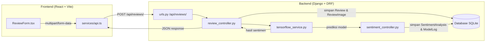

# Multimodal AI — Sentiment Analysis Review Produk

Aplikasi **analisis sentimen multimodal** (teks + gambar) untuk review produk. Sistem menggabungkan hasil analisis teks dan gambar menjadi satu sentimen gabungan (*fusion sentiment*) menggunakan model deep learning berbasis **TensorFlow**.

## ✨ Fitur

- Kirim review produk beserta teks, rating, dan gambar (opsional)
- Analisis sentimen teks dan gambar secara paralel
- Fusi sentimen multimodal (teks + gambar) menjadi satu label: `negative`, `neutral`, atau `positive`
- Skor kepercayaan (*confidence score*) dari model
- Penyimpanan riwayat analisis & log model ke database

## 🧱 Tech Stack

| Lapisan     | Teknologi                                            |
|-------------|------------------------------------------------------|
| Backend     | Django, Django REST Framework, TensorFlow, NumPy     |
| Frontend    | React 18, TypeScript, Vite, Tailwind CSS, Axios      |
| Database    | SQLite (bawaan Django)                               |

## 🏗️ Arsitektur



## 📁 Struktur Proyek

```
multimodal/
├── manage.py
└── multimodal/
    ├── settings.py            # Konfigurasi Django
    ├── urls.py                # URL utama
    ├── backend/
    │   ├── apps/
    │   │   └── revie/         # Aplikasi review & sentiment analysis
    │   │       ├── models.py          # User, Product, Review, ReviewImage, SentimentAnalysis, ModelLog
    │   │       ├── serializers.py     # Serializer DRF
    │   │       ├── urls.py            # Endpoint /api/reviews/
    │   │       ├── controllers/
    │   │       │   ├── review_controller.py
    │   │       │   └── sentiment_controller.py
    │   │       └── services/
    │   │           └── tensorflow_service.py   # Load & jalankan model TensorFlow
    │   └── config/
    │       ├── settings.py
    │       └── urls.py
    ├── frontend/              # Aplikasi React + TypeScript
    │   ├── src/
    │   │   ├── App.tsx
    │   │   ├── pages/ReviewPage.tsx
    │   │   ├── components/ReviewForm.tsx
    │   │   ├── services/api.ts
    │   │   └── types/review.ts
    │   └── package.json
    └── models/                # Folder model TensorFlow (sentiment_model)
```

## 🗃️ Skema Database

| Model              | Field Utama                                                              | Deskripsi                                    |
|--------------------|--------------------------------------------------------------------------|----------------------------------------------|
| `User`             | `user_id`, `name`, `email`, `created_at`                                 | Pengguna yang memberi review                 |
| `Product`          | `product_id`, `name`, `category`, `price`, `created_at`                  | Produk yang di-review                        |
| `Review`           | `review_id`, `user`, `product`, `review_text`, `rating`, `created_at`    | Data review (teks & rating)                  |
| `ReviewImage`      | `image_id`, `review`, `image_url`, `uploaded_at`                         | Gambar pendukung review                      |
| `SentimentAnalysis`| `analysis_id`, `review`, `text_sentiment`, `image_sentiment`, `fusion_sentiment`, `confidence_score`, `analyzed_at` | Hasil analisis sentimen |
| `ModelLog`         | `log_id`, `analysis`, `model_used`, `execution_time`, `status`           | Log eksekusi model                           |

## 🔌 API Endpoint

### `POST /api/reviews/`

Membuat review baru dan menjalankan analisis sentimen multimodal.

**Request** (`multipart/form-data`):

| Field        | Tipe   | Wajib | Keterangan                          |
|--------------|--------|-------|-------------------------------------|
| `user_id`    | string | ✅    | UUID user                           |
| `product_id` | string | ✅    | UUID produk                         |
| `review_text`| string | ✅    | Isi review                          |
| `rating`     | int    | ✅    | Rating 1–5                          |
| `image`      | file   | ❌    | Gambar review (opsional)            |

**Response** (contoh):

```json
{
  "review_id": "a1b2c3d4-...",
  "sentiment": {
    "fusion_sentiment": "positive",
    "confidence_score": 0.87
  }
}
```

## 🚀 Menjalankan Proyek

### Prasyarat

- Python 3.12+
- Node.js 18+
- TensorFlow & dependencies backend (lihat `myenv/` virtual environment)

### 1. Backend (Django)

```bash
# Aktifkan virtual environment
source /home/arifikimiaunila/django-projects/myenv/bin/activate

# Masuk ke direktori proyek
cd multimodal

# Migrasi database
python manage.py migrate

# Jalankan server
python manage.py runserver
```

Backend berjalan di `http://localhost:8000`.

### 2. Frontend (React + Vite)

```bash
cd multimodal/multimodal/frontend

# Install dependencies
npm install

# Jalankan dev server
npm run dev
```

Frontend berjalan di `http://localhost:5173` (bawaan Vite).

> ⚠️ Pastikan `baseURL` pada `frontend/src/services/api.ts` menunjuk ke URL backend yang benar (default: `http://localhost:8000/api`).

## 🧠 Catatan Model AI

Model dimuat dari `models/sentiment_model` saat startup. Saat ini pipeline masih menggunakan **placeholder/dummy**:

- `text_embedding` → random vector `(1, 768)` (rencana: pipeline **BERT**)
- `image_array` → random tensor `(1, 224, 224, 3)` (rencana: **CNN**)

Ganti implementasi dummy di `backend/apps/revie/services/tensorflow_service.py` dengan pipeline preprocessing sesungguhnya sebelum produksi.

## 📌 Roadmap

- [ ] Implementasi preprocessing teks (BERT embedding)
- [ ] Implementasi feature extraction gambar (CNN)
- [ ] Arsitektur fusion model yang sesungguhnya
- [ ] Endpoint GET untuk riwayat review & hasil analisis
- [ ] Migrasi database ke MySQL/PostgreSQL
- [ ] Autentikasi pengguna (JWT)
- [ ] Deployment frontend build ke production server
